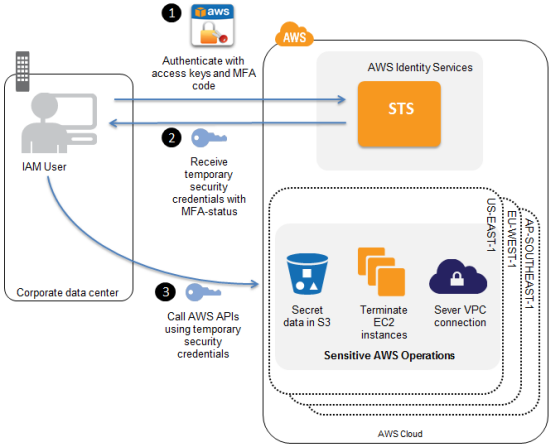
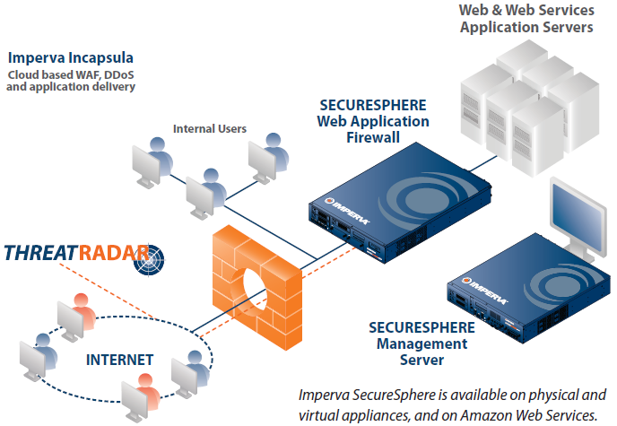

# Network Security Policy
This network security policy is planned to secure customer information, business documents and sensitive data of any company (Bank, Healthcare, E-commerce, etc.). We will address this problem under seven main headings. Our main goal in this policy is to reduce security risks and take appropriate security measures. As a result of this policy, it is thought that company success and trust will be strengthened and customer satisfaction will increase.

# Contents 
### 1. Network Access Control
   - [1.1 Role Based Access Control (RBAC)](#bolum-1.1)
   - [1.2 Multi Factor Authentication (MAF)](#bolum-1.2)

### 2. Data Security 
   - [2.1 Data Encryption](#bolum-2.1)

### 3. Network Traffic Monitoring and Control
   - [3.1 Network Traffic Monitoring Tools](#bolum-3.1)
   - [3.2 Firewalls](#bolum-3.2) 

### 4. Backup
   - [4.1 Data Backup Strategies](#bolum-4.1)

### 5. Update Tracking 
   - [5.1 Update Tracking](#bolum-5.1)

### 6. Staff Training 
   - [6.1 Social Engineering Awarness](#bolum-6.1)
   - [6.2 Response / Scenario Based Educations](#bolum-6.2)

### 7. Monitoring and Supervision
   - [7.1 Auditing](#bolum-7.1)

### 8. References
   

---

# 1. Network Access Control
## <h4 id = "bolum-1.1">1.1 Role Based Access Control (RBAC)</h4>

    Role-based access control is a powerful
mechanism developed to provide access control in the areas of system management and data security. The basic principle of the mechanism is that users within an organization are granted access according to their roles and responsibilities, ensuring that users can only access the information and resources required for the functions they are responsible for.
 
 With the use of this system in the health sector, it has enabled employees with different roles such as doctors and nurses to receive different degrees of access in line with the principle of patient confidentiality and in accordance with HIPAA regulations. 

## <h4 id = "bolum-1.2"> 1.2 Multi Factor Authentication (MAF)</h4>

    Multi-factor authentication is a security measure
that will ensure that access is made through multiple stages, not just a password during user access. For example, in addition to the password, it prevents unauthorized access with a code to be sent to e-mail addresses, a secret question answer or a second verification method with biometric data.
 

At this stage, there are various applications that can vary according to wishes and needs. For example, Google Authenticator, Amazon Web Services (AWS) (figure 1) support various authentication methods such as SMS, authentication applications or hardware security keys for MFA access. The application to be chosen depends on the platforms supported.
 

# 2. Data Security 

## <h4 id= " bolum-2.1"> 2.1 Data Encryption</h4>

Data encryption, unauthorized access to sensitive information,
to protect against possible attacks, such as the use or alteration of information. This process converts the original representation of information, known as plaintext, into an alternative form known as ciphertext. Only authorized users can access the decrypted data.
 

There are multiple encryption methods for encrypting data. Advanced Encryption System (AES), the most widely used and recognized as secure, is a symmetric block cipher algorithm used to encrypt and decrypt electronic data. It was approved in 2001 by the US National Institute of Standards (NIST). AES uses secret keys of 128 bits, 192 bits or 256 bits in length, and the size of these keys is directly proportional to the difficulty of breaking the cipher. The data to be encrypted is divided into blocks of 128 bit lengths and then ciphertexts are generated. The decryption process uses the same AES algorithm but with a decryption key. By encrypting the data, GDPR compliance requirements can be met.

Considering that static data will also be a target for attacks, we can increase database security by encrypting the data in storage with Transparent Data Encryption. In this case, there are different alternatives according to the services we use, some of them are Microsoft SQL Server, Oracle Database and PostgreSQL.

# 3. Network Traffic Monitoring and Control

## <h4 id= " bolum-3.1"> 3.1. Network Traffic Monitoring Tools</h4>

Network traffic monitoring tools are applications that help us observe and analyze data traffic on a network. Thanks to this analysis, we can run the system at an optimal level and identify security vulnerabilities, in addition to helping us troubleshoot problems.

In this context, there are many applications available, but usage preference varies according to needs and system. Some of these applications are: Wireshark,
 
Netflow Analyzer, Splunk. Assuming we are going to analyze a large network, the Splunk application (figure 2) is more useful for data correlation and analysis. Through this application
data collection, data indexing, data analysis and data visualization functions can be used.

## <h4 id= " bolum-3.2"> 3.2. Firewalls</h4>

Firewalls are designed to filter and make more secure the exchange of data between one network and another network or the internet. They do this by examining incoming and outgoing data packets following certain protocols. They are divided into different categories according to their use. Personal firewalls (Windows Defender Firewall, Bitdefender), Network firewalls (pfSense, OPNSense), Web firewalls - WAF (Cloudflare, Imperva SecureSephere), Application layer firewalls - ALG (McAfee Application Control, Deepwatch Application Defense), The functions of firewalls are to prevent unauthorized access, block malware, protect network traffic, etc. The most striking among these applications is Imperva SecureSephere (figure 3). Although it is a paid WAF, it draws attention with its ability to be used locally. In addition to protecting web applications by blocking DDoS attacks and other online threats, it allows you to ensure your network security locally.

# 4. Data Backup

## <h4 id= "bolum-4.1"> 4.1. Data Backup Strategies</h4>

A data backup is a copy of our system and application data stored in a different location, separate from the original. The need for this copy is sometimes caused by natural disasters, human error, security incidents or system In cases such as malfunctions, our data may be unexpectedly lost or damaged. For this reason, having a data backup for each company is the most important step in solving such problems. 
 

Several commonly used backup methods:
 

 - Full backup: involves a complete copy of the available data. It is the most comprehensive backup method but requires high requirements in terms of time and storage space.
 

 - Incremental Backup: Refers to backing up changes made since the last full backup. It provides small backup files and a fast backup time.
 

 - Open File Backup: Enables backup of running files and applications. This prevents files or applications from being locked during data backup and ensures business continuity.
 

 - Continuous Data Protection: CDP is a backup strategy that instantly records all data changes in a system. This ensures access to the most up-to-date data at all times and minimizes data loss.
 

A company backup plan can be made with these and similar data backup strategies. The most commonly used system for this is the use of Full backup and Incremental backup methods together. Full backup frequency is once a week and incremental backup is used daily. Backup data is located in different locations with three different copies. In this way, necessary measures are taken to prevent data loss.

# 5. Update Tracking

## <h4 id= "bolum-5.1"> 5.1 Update Tracking</h4>

 Update tracking is a necessary condition for us to have the latest versions of the system we use. Updates often fix vulnerabilities, fix bugs and provide the opportunity to work with new methods. It helps us adapt faster to unexpected bugs and evolving methods. Not following updates can make our data more vulnerable to cyber attacks. 

# 6. Staff Training

## <h4 id= "bolum-6.1"> 6.1 Social Engineering Awareness</h4>

Social engineering plays an important role in the success of many cyber attacks. It is very important to provide social engineering awareness training to employees against the risk of being tricked and infiltrated by fake emails or fake calls. The success of these attacks may vary depending on the employee's level of education, level of awareness and level of compliance with the company's security policies. By increasing social engineering awareness with this staff training, we can be more careful against such attacks.

## <h4 id= "bolum-6.2"> 6.1 Response / Scenario Based Educations</h4>

Such trainings raise employee awareness on how to respond to cyber-attacks and combine theoretical knowledge with practical applications to ensure that employees are ready for real-life cyber-attacks.

# 7. Monitoring and Supervision

## <h4 id= "bolum-7.1"> 7.1 Monitoring and Supervision </h4>

Monitoring and auditing can help protect the
organization from cyber threats by periodically
checking network requirements and detecting and
responding to anomalies and unauthorized activities
in systems. External resources can be used for auditing. 
